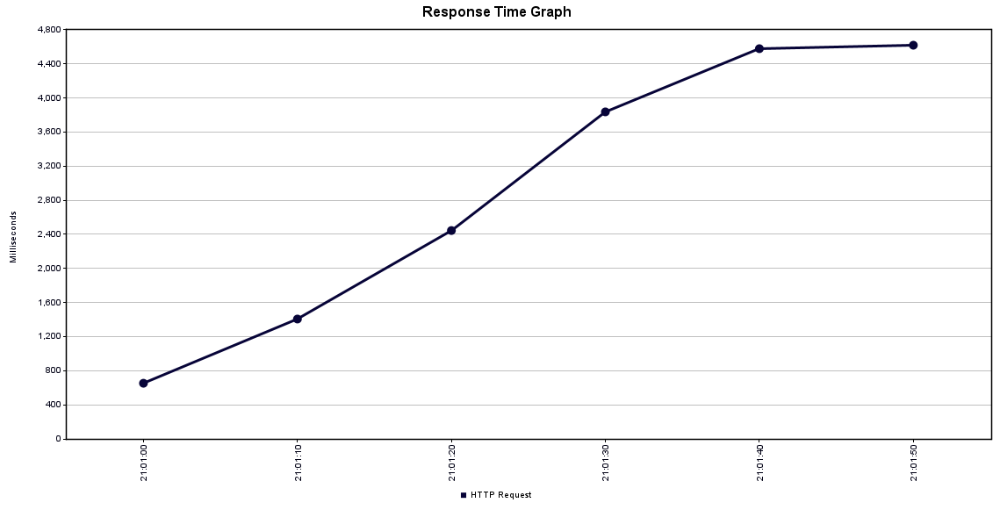
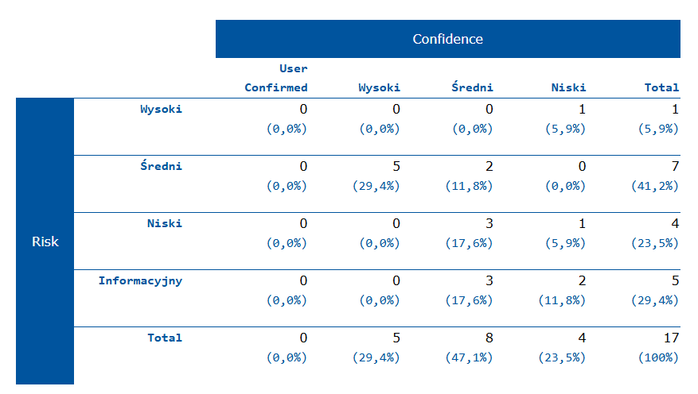

# Testowanie Oprogramowania

## Michał Kaniowski

---

## Testy jednostkowe i Integracyjne

### Testy komponentów

**Test nawigacji do listy zakupów po kliknięciu przycisku "lists"**

Warunki początkowe: Zamockowane useNavigate i useKeycloak, komponent Navbar wyrenderowany z tłumaczeniami.

Procedura: Kliknięcie w przycisk "lists" po znalezieniu go w renderze.

Warunki końcowe: Funkcja mockNavigate wywołana raz z parametrem { to: '/shopping-list' }.

---

**Test renderowania komponentu RegisterCard**

Warunki początkowe: Zamockowana funkcja handleSubmit, komponent RegisterCard wyrenderowany z tłumaczeniami.

Procedura: Renderowanie komponentu RegisterCard.

Warunki końcowe: Elementy register-card-title i register-form są obecne w dokumencie.

---

#### Testy komponentu RegisterForm:

**Montaż komponentu**

Warunki początkowe: RegisterForm renderowany w kontekście tłumaczeń.

Procedura: Renderowanie komponentu.

Warunki końcowe: Brak błędów przy montażu.

---

**Renderowanie elementów formularza**

Warunki początkowe: RegisterForm renderowany z zamockowaną funkcją handleSubmit.

Procedura: Renderowanie komponentu.

Warunki końcowe: Obecność elementów: pola tekstowe first name, last name, username, email, pole hasła, przycisk register.

---

**Wyłączony przycisk przy nieprawidłowym formularzu**

Warunki początkowe: Formularz renderowany, brak danych wejściowych.

Procedura: Wywołanie zdarzeń blur dla wszystkich pól.

Warunki końcowe: Przycisk register jest wyłączony.

---

**Włączony przycisk przy prawidłowym formularzu**

Warunki początkowe: Formularz renderowany, dane wejściowe uzupełnione prawidłowo.

Procedura: Uzupełnienie pól first name, last name, username, email, password wartościami spełniającymi walidację.

Warunki końcowe: Przycisk register nie jest wyłączony.

---

#### Testy komponentu ProductCard:

**Wyświetlanie nazwy produktu**

Warunki początkowe: ProductCard renderowany z produktem mockProduct.

Procedura: Renderowanie komponentu.

Warunki końcowe: Nazwa Test Product widoczna w dokumencie.

---

**Wyświetlanie ilości i jednostki produktu**

Warunki początkowe: ProductCard renderowany z produktem mockProduct.

Procedura: Renderowanie komponentu.

Warunki końcowe: Widoczne 2 pcs.

---

**Wywołanie handleRemoveProduct po kliknięciu przycisku usuwania**

Warunki początkowe: ProductCard renderowany z zamockowaną funkcją handleRemoveProduct.

Procedura: Kliknięcie przycisku trash.

Warunki końcowe: Funkcja handleRemoveProduct wywołana z mockProduct.

---

**Otwarcie dialogu po kliknięciu przycisku edycji**

Warunki początkowe: ProductCard renderowany z zamockowaną funkcją handleUpdateProduct.

Procedura: Kliknięcie przycisku edit.

Warunki końcowe: Widoczny dialog w dokumencie.

---

#### Testy komponentu ProductDialog

**Wyświetlanie nazwy produktu w dialogu**

Warunki początkowe: Komponent ProductDialogWrapper z mockProduct.

Procedura: Kliknięcie przycisku wywołującego dialog.

Warunki końcowe: Widoczny tytuł dialogu Test Product.

---

**Wywołanie handleSubmit po przesłaniu formularza**

Warunki początkowe: Komponent ProductDialogWrapper z zamockowaną funkcją handleSubmit.

Procedura: Wprowadzenie wartości Updated Product, 5, i kg do odpowiednich pól, przesłanie formularza.

Warunki końcowe: Funkcja handleSubmit wywołana z wartościami:
```json
{
    "id": "1",
    "name": "Updated Product",
    "quantity": 5,
    "quantityType": "kg"
}
```

---

**Wyświetlanie błędów walidacji**

Warunki początkowe: Komponent ProductDialogWrapper z zamockowaną funkcją handleSubmit.

Procedura: Usunięcie wartości z pola name i przesłanie formularza.

Warunki końcowe: Widoczne komunikaty błędów dla pól name, quantity, i quantityType.

---

#### Testy komponentu ProductForm


**Renderowanie komponentu ProductForm**

Warunki początkowe: Komponent ProductForm z zamockowaną funkcją handleSubmit.

Procedura: Renderowanie komponentu.

Warunki końcowe: W komponentcie znajdują się pola name-input, quantity-input, quantity-type-input, oraz przycisk submit-button.

---

**Wywołanie handleSubmit po przesłaniu formularza**

Warunki początkowe: Komponent ProductForm z zamockowaną funkcją handleSubmit.

Procedura: Wprowadzenie wartości do pól name-input, quantity-input, i quantity-type-input, a następnie przesłanie formularza.

Warunki końcowe: Funkcja handleSubmit wywołana z danymi:

```json
{
    "id": "",
    "name": "Test Product",
    "quantity": 10,
    "quantityType": "kg"
}
```

---

**Wyświetlanie błędów walidacji**

Warunki początkowe: Komponent ProductForm z zamockowaną funkcją handleSubmit.

Procedura: Przesłanie formularza bez uzupełniania wymaganych pól.

Warunki końcowe: Wyświetlenie komunikatów błędów dla pól name, quantity, i quantityType.

---

#### Testy komponentu ShoppingListDialog


**Renderowanie tytułu i opisu dialogu**

Warunki początkowe: Komponent ShoppingListDialogWrapper z zamockowaną funkcją onSubmit.

Procedura: Kliknięcie na element wyzwalający dialog (dialog-trigger).

Warunki końcowe: Oczekiwane, że tytuł i opis dialogu zostaną wyświetlone.

---

**Wywołanie handleSubmit po przesłaniu formularza**

Warunki początkowe: Komponent ShoppingListDialogWrapper z zamockowaną funkcją handleSubmit.

Procedura: Wprowadzenie wartości do pola name-input (np. "New Shopping List") i przesłanie formularza.

Warunki końcowe: Funkcja handleSubmit wywołana z wartością:

```json
{
    "name": "New Shopping List"
}
```

---

**Wyświetlanie błędów walidacji**

Warunki początkowe: Komponent ShoppingListDialogWrapper z zamockowaną funkcją onSubmit.

Procedura: Przesłanie formularza z pustym polem name-input.

Warunki końcowe: Wyświetlenie komunikatu błędu dla pola name.

---

#### Testy komponentu ShoppingListsCard


**Renderowanie nazwy listy i produktów**

Warunki początkowe: Komponent ShoppingListsCard z listą zawierającą produkty.

Procedura: Renderowanie komponentu z przykładową listą produktów.

Warunki końcowe: Sprawdzenie, czy nazwa listy ("Groceries") oraz produkty ("Milk", "Eggs") są widoczne na ekranie.

---

**Wyświetlanie komunikatu "no products" dla pustej listy**

Warunki początkowe: Komponent ShoppingListsCard z pustą listą.

Procedura: Renderowanie komponentu z pustą listą produktów.

Warunki końcowe: Sprawdzenie, czy pojawił się komunikat "No Products" w przypadku pustej listy.

---

**Wywołanie handleRemoveList po kliknięciu przycisku usuwania**

Warunki początkowe: Komponent ShoppingListsCard z listą produktów.

Procedura: Kliknięcie przycisku usuwania listy (delete-button).

Warunki końcowe: Sprawdzenie, czy funkcja handleRemoveList została wywołana z odpowiednim ID listy oraz sprawdzenie, czy została wywołana dokładnie raz.

---

**Nawigacja do odpowiedniego URL po kliknięciu przycisku edycji**

Warunki początkowe: Komponent ShoppingListsCard z listą produktów.

Procedura: Kliknięcie przycisku edycji listy (edit-button).

Warunki końcowe: Sprawdzenie, czy funkcja mockNavigate została wywołana z odpowiednim URL i parametrami (/shopping-list/$listId, z parametrem listId: '1').


---

#### Test komponentu ErrorView

**Sprawdzenie, czy komunikat o błędzie jest wyświetlany**

Warunki początkowe: Komponent ErrorView renderowany bez żadnych dodatkowych propsów.

Procedura: Renderowanie komponentu ErrorView.

Warunki końcowe: Sprawdzenie, czy na ekranie pojawił się tekst "Ooops! An error has occurred", który jest spodziewanym komunikatem o błędzie.

Ten test zapewnia, że komponent ErrorView poprawnie renderuje komunikat o błędzie w przypadku wystąpienia problemu.

---

#### Test komponentu NotFoundView

**Sprawdzenie, czy komunikat o braku strony jest wyświetlany**

Warunki początkowe: Komponent NotFoundView renderowany bez żadnych dodatkowych propsów.

Procedura: Renderowanie komponentu NotFoundView.

Warunki końcowe: Sprawdzenie, czy na ekranie pojawił się tekst "Not found :c", który jest spodziewanym komunikatem o braku strony.

Ten test zapewnia, że komponent NotFoundView poprawnie renderuje komunikat, kiedy nie znaleziono żądanej strony.

---

#### Test komponentu ErrorBoundary

**Sprawdzenie, czy wyświetlany jest komunikat o błędzie, gdy dziecko zgłasza błąd**

Warunki początkowe: Komponent ErrorBoundary zawiera komponent ThrowError, który celowo rzuca błąd.

Procedura: Renderowanie komponentu ErrorBoundary z komponentem ThrowError w środku, który zgłasza błąd.

Warunki końcowe: Sprawdzenie, czy na ekranie pojawił się komunikat "Something went wrong!", co wskazuje na to, że ErrorBoundary poprawnie przechwycił błąd i wyświetlił odpowiedni komunikat.

---

**Sprawdzenie, czy dzieci są renderowane, gdy nie występuje błąd**

Warunki początkowe: Komponent ErrorBoundary zawiera zwykły komponent (np. <div>Child component</div>).

Procedura: Renderowanie komponentu ErrorBoundary z normalnym komponentem dziecka.

Warunki końcowe: Sprawdzenie, czy zawartość dzieci (tekst "Child component") została poprawnie wyświetlona na ekranie.

Ten test zapewnia, że ErrorBoundary poprawnie obsługuje błędy w komponentach dzieci i wyświetla odpowiedni komunikat, ale również pozwala na normalne renderowanie dzieci, gdy nie występuje żaden błąd.


---

### Testy serwisów

#### ShoppingListService:

**should return shopping list for authorized user**

Warunki początkowe: Autoryzowany użytkownik (ustawiony w mocku Authentication) ma istniejącą listę zakupów w bazie danych.

Procedura: Wywołanie metody getShoppingListById z identyfikatorem listy zakupów, która należy do użytkownika.

Warunki końcowe: Zwrócony status HTTP to 200 OK, a odpowiedź zawiera szczegóły listy zakupów. Metoda findById w repozytorium została wywołana raz.

---

**should return UNAUTHORIZED if user is not authenticated**

Warunki początkowe: Brak kontekstu użytkownika (wyczyszczony SecurityContextHolder).

Procedura: Wywołanie metody getShoppingListById z dowolnym identyfikatorem listy zakupów.

Warunki końcowe: Zwrócony status HTTP to 401 UNAUTHORIZED, a odpowiedź nie zawiera danych.

---

**should create a new shopping list**

Warunki początkowe: Użytkownik jest zalogowany (ustawiony w mocku Authentication), brak istniejącej listy zakupów o podanej nazwie.

Procedura: Wywołanie metody createShoppingList z nazwą "Groceries".

Warunki końcowe: Zwrócony status HTTP to 201 CREATED, a odpowiedź zawiera szczegóły nowo utworzonej listy zakupów.

---

**should delete shopping list if user is authorized**

Warunki początkowe: Autoryzowany użytkownik (ustawiony w mocku Authentication) ma istniejącą listę zakupów w bazie danych.

Procedura: Wywołanie metody deleteShoppingList z identyfikatorem listy należącej do użytkownika.

Warunki końcowe: Zwrócony status HTTP to 204 NO CONTENT. Metody findById i delete w repozytorium zostały wywołane po razie.

---

**should return FORBIDDEN if user tries to delete another user's list**

Warunki początkowe: Użytkownik zalogowany (ustawiony w mocku Authentication) próbuje usunąć listę zakupów, która należy do innego użytkownika.

Procedura: Wywołanie metody deleteShoppingList z identyfikatorem listy innego użytkownika.

Warunki końcowe: Zwrócony status HTTP to 403 FORBIDDEN. Metoda delete w repozytorium nie została wywołana.

---

**should update a shopping list**

Warunki początkowe: Autoryzowany użytkownik (ustawiony w mocku Authentication) ma istniejącą listę zakupów w bazie danych.

Procedura: Wywołanie metody updateShoppingList z identyfikatorem listy oraz nowymi danymi (np. lista produktów).

Warunki końcowe: Zwrócony status HTTP to 200 OK. Lista zakupów została zaktualizowana zgodnie z przekazanymi danymi.

---

**should add a product to a shopping list**

Warunki początkowe: Autoryzowany użytkownik (ustawiony w mocku Authentication) ma istniejącą listę zakupów bez produktów.

Procedura: Wywołanie metody addProductToShoppingList z identyfikatorem listy i danymi nowego produktu.

Warunki końcowe: Zwrócony status HTTP to 200 OK. Produkt został dodany do listy zakupów.

---


**should remove a product from a shopping list**

Warunki początkowe: Autoryzowany użytkownik (ustawiony w mocku Authentication) ma istniejącą listę zakupów z przynajmniej jednym produktem.

Procedura: Wywołanie metody removeProductFromShoppingList z identyfikatorem listy i produktem do usunięcia.

Warunki końcowe: Zwrócony status HTTP to 200 OK. Produkt został usunięty z listy zakupów.

---

## Testy E2E

### Testowanie loginu/rejestracji

Inicjalizacja danych testowych:

W bloku before() generowane są losowe dane użytkownika (imię, nazwisko, nazwa użytkownika, e-mail i hasło) za pomocą biblioteki faker. Hasło jest generowane tak, aby spełniało określone wymagania (musi zawierać wielką literę, cyfrę oraz znak specjalny). Te dane będą używane do testów rejestracji i logowania.
Przygotowanie przed każdym testem:

W bloku beforeEach() cyklicznie otwierana jest strona główna aplikacji (http://localhost:8000/) za pomocą komendy cy.visit(). Ustawienie sesji "visit site" zapewnia, że przed każdym testem użytkownik jest na stronie głównej aplikacji.
Test rejestracji:

Test it('register') ma na celu sprawdzenie poprawności działania formularza rejestracji. Test polega na odwiedzeniu strony rejestracji (/register), wypełnieniu formularza danymi (imię, nazwisko, nazwa użytkownika, e-mail, hasło) i kliknięciu przycisku submit. Zanim formularz zostanie wysłany, wartości są wpisywane w odpowiednie pola i wykonane są operacje rozmycia (blur()) dla każdego z nich. Po kliknięciu przycisku submit, test czeka 5 sekund na zakończenie operacji.
Test logowania:

Test it('login') sprawdza funkcjonalność logowania. Użytkownik ponownie odwiedza stronę główną aplikacji, wprowadza dane logowania (nazwę użytkownika oraz hasło) i wysyła formularz logowania. Następnie sprawdzany jest tytuł strony, który powinien odpowiadać wartości "Vite + React + TS", co potwierdza poprawność zalogowania.
Te testy mają na celu sprawdzenie, czy proces rejestracji i logowania działa zgodnie z oczekiwaniami w aplikacji.


### Testowanie listy zakupów

Przygotowanie przed każdym testem:

W bloku beforeEach() użytkownik loguje się na stronie. Testy zaczynają się od odwiedzenia strony głównej aplikacji (http://localhost:8000/), gdzie użytkownik wprowadza dane logowania (username jako "michasbueno" oraz password jako "Password123$"). Po zalogowaniu sesja jest utrzymywana, co pozwala na przeprowadzanie kolejnych testów.
Test dodawania listy zakupów:

Test it('add list') sprawdza, czy możliwe jest dodanie nowej listy zakupów. Po zalogowaniu, użytkownik kliknięciem przycisku "Listy zakupów" przechodzi do sekcji list. Następnie wybiera przycisk, aby otworzyć formularz, w którym wpisuje nazwę listy (np. "Testowa lista"). Po zatwierdzeniu formularza lista pojawia się na liście zakupów, a test sprawdza, czy nowa lista jest widoczna.
Test dodawania produktu do listy:

Test it('add product') sprawdza, czy możliwe jest dodanie produktu do wcześniej utworzonej listy zakupów. Po przejściu do sekcji "Listy zakupów", użytkownik wybiera istniejącą listę ("Testowa lista") i przechodzi do formularza dodawania produktu. W formularzu wprowadza nazwę produktu (np. "Testowy produkt") oraz ilość ("1 szt"). Po zatwierdzeniu formularza, produkt powinien zostać dodany do listy, a test sprawdza, czy produkt jest widoczny na liście, wraz z odpowiednią ilością.
Test usuwania produktu z listy:

Test it('delete product') sprawdza, czy możliwe jest usunięcie produktu z listy zakupów. Po zalogowaniu, użytkownik przechodzi do sekcji "Listy zakupów", następnie edytuje listę i wybiera produkt ("Testowy produkt"), który wcześniej został dodany. Test sprawdza, czy produkt jest obecny na liście i klikając odpowiedni przycisk, usuwa go z listy zakupów.
Test usuwania listy zakupów:

Test it('delete list') sprawdza, czy możliwe jest usunięcie listy zakupów. Użytkownik po zalogowaniu przechodzi do sekcji "Listy zakupów", wybiera listę ("Testowa lista") i usuwa ją. Test sprawdza, czy lista została usunięta i nie pojawia się już na liście zakupów.
Wszystkie te testy mają na celu weryfikację, czy funkcje związane z zarządzaniem listami zakupów (tworzenie, edytowanie i usuwanie) działają poprawnie w aplikacji.

## Testy wydajnościowe



## Testy Bezpieczeństwa




